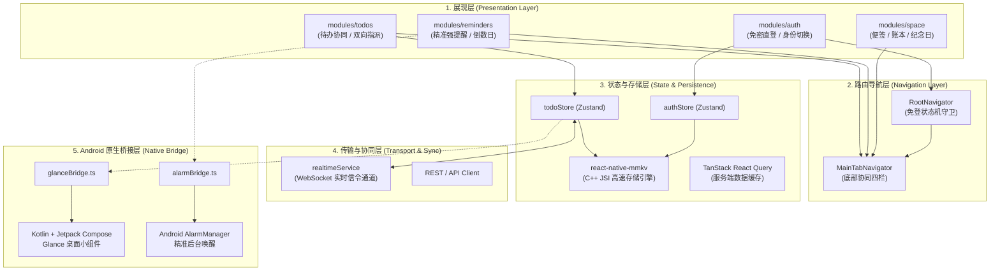
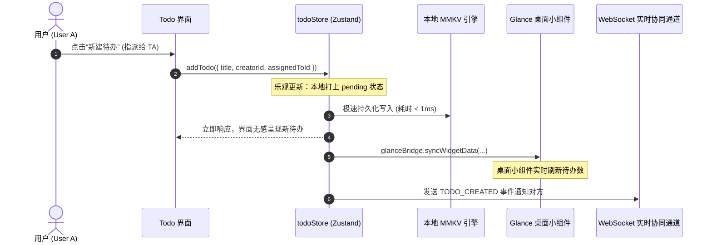
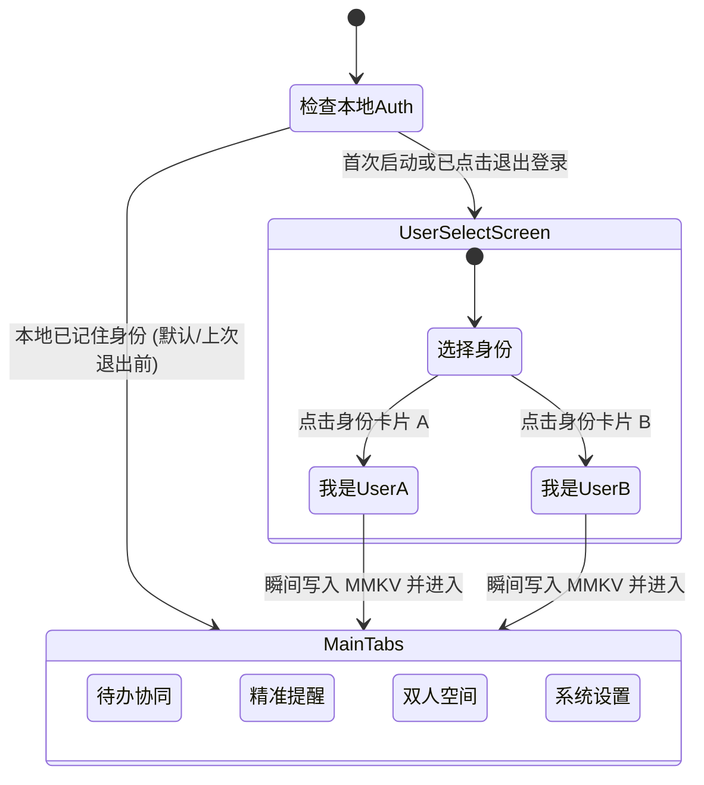

# 双人专属私有空间移动端 App 前端架构设计文档

> **版本**：v1.0.0  
> **面向场景**：极简私密、固定两人、离线优先、原生深度扩展

---

## 1. 架构愿景与核心设计哲学

### 1.1 核心痛点与解决思路
传统双人/情侣类应用往往充斥着繁复的“注册账号 -> 生成邀请码 -> 对方输入配对码 -> 创建情侣空间 -> 权限审核”入驻链路。
对于特定两人使用的私有 App 而言，这类流程是纯粹的摩擦成本与冗余。

**本项目的核心设计哲学：**
1. **绝对无入驻引导（Zero Onboarding Friction）**：两个特定用户（User A 与 User B）在系统层预置与硬编码，登录即直入共同数据空间，无邀请码、无配对流程。
2. **离线优先与瞬时响应（Offline-First & Instant UI）**：基于 `react-native-mmkv`（C++ JSI 键值库），本地读写延迟低于毫秒级，所有待办增删改查均先落地本地再异步标记上报。
3. **双人协同状态清晰可溯（Clear Dual Ownership）**：任务支持“我的” / “TA的”双向指派，完成动作记录操作人，提供一键“催一下”交互。
4. **Android 现代化原生扩展就绪（Jetpack Compose Native Readiness）**：架构解耦，通过轻量 TS Native Bridge 预留 Android Glance 桌面小组件与精准系统 `AlarmManager` 强提醒能力。

---

## 2. 整体分层架构 (Layered Architecture)

系统遵循清晰的单向数据流与关注点分离原则，整体划分为五层：



---

## 3. 领域模型与固定身份设计 (Domain Model)

### 3.1 预置双人身份 (`src/config/users.ts`)
系统严格限定两名参与者：

```typescript
export type FixedUserId = 'user_a' | 'user_b';

export interface UserProfile {
  id: FixedUserId;
  name: string;
  avatarBg: string;
  badgeColor: string;
  title: string;
}

export const FIXED_USERS: Record<FixedUserId, UserProfile> = {
  user_a: { id: 'user_a', name: '我 (User A)', badgeColor: '#3b82f6', ... },
  user_b: { id: 'user_b', name: 'TA (User B)', badgeColor: '#f43f5e', ... },
};
```

### 3.2 待办协同领域模型 (`src/types/todo.ts`)
每项数据均包含明确的责任人与操作者轨迹：

```typescript
export interface TodoItem {
  id: string;
  title: string;
  description?: string;
  creatorId: FixedUserId;       // 创建者
  assignedToId: FixedUserId;    // 责任人 (我 或 TA)
  completed: boolean;
  completedBy?: FixedUserId;    // 打钩完成者
  completedAt?: string;         // 完成时间戳
  nudgeCount: number;           // 被催办次数
  lastNudgeAt?: string;         // 最近催办时间
  dueDate?: string;             // 截止期
  createdAt: string;
  updatedAt: string;
  syncStatus: 'synced' | 'pending' | 'conflict'; // 离线同步标记
}
```

---

## 4. 状态管理与离线持久化 (State & Offline Storage)

### 4.1 架构实现机制
- **存储内核**：`react-native-mmkv`（MMKV 是微信开源并由 Marc Rousavy 深度封装的 JSI 原生模块），相较于传统的 `AsyncStorage`（基于异步 bridge 和 JSON 字符串反序列化），MMKV 的读写速度提升了数十倍。
- **状态流转引擎**：`zustand` + `persist` 中间件，自动将 store 中的 `todos` 与 `auth` 状态序列化存入本地 MMKV 实例。

### 4.2 离线优先与乐观更新流转 (Optimistic Data Flow)



---

## 5. 导航体系与免密直登设计 (Navigation Architecture)

### 5.1 零配对路由守卫 (`src/navigation/RootNavigator.tsx`)
系统完全摒弃了传统 App 的“引导页 -> 手机号登录 -> 邀请码配对”等流程：



---

## 6. Android 原生扩展层 (Native Bridge & Compose Glance)

针对 Android 端的高阶功能诉求，前端通过模块化接口解耦，预留原生对接通道：

### 6.1 Jetpack Compose Glance 桌面小组件 (`src/native-bridge/glanceBridge.ts`)
- **定位**：利用 Google 官方的 Jetpack Glance 框架，用声明式 Compose 语法编写高性能 Android 桌面 Widget。
- **数据通道**：当 React Native 层 `todoStore` 发生变动（增删、打钩、催办）时，通过 `glanceBridge.syncWidgetData` 将精简的双人待办统计数据序列化存入系统 `SharedPreferences`，并触发 Glance Widget 的 `updateAll()` 广播重绘。

### 6.2 AlarmManager 精准强提醒 (`src/native-bridge/alarmBridge.ts`)
- **定位**：解决 Android 系统休眠（Doze 模式）下常规推送被延迟或被杀进程的问题。
- **实现**：桥接系统 `AlarmManager.setExactAndAllowWhileIdle()`，在设定的绝对时间戳触发，即使屏幕熄灭亦能唤醒全屏强提醒。

---

## 7. 实时协同机制 (Realtime Synchronization)

### 7.1 WebSocket 信令规范 (`src/services/realtime/websocket.ts`)
App 启动后自动建立长连接，双方在同一个专属私有频道（Private Room）中协同：

| 消息类型 | 触发时机 | 负载 (Payload) | 接收方响应 |
| :--- | :--- | :--- | :--- |
| `TODO_CREATED` | 任一方创建待办 | `{ todo: TodoItem }` | 本地 store 自动合并入库 |
| `TODO_COMPLETED` | 任一方勾选完成 | `{ todoId, operatorId }` | 触发乐观翻转并记录完成人 |
| `NUDGE_RECEIVED` | 任一方点击“催一下” | `{ todoId }` | 增加被催次数，触发系统震动/本地提醒 |
| `PARTNER_ONLINE` | 进入应用上线 | `{ timestamp }` | 更新对方在线状态指示灯 |

---

## 8. 工程化规范与代码组织

1. **类型安全**：全面开启 TypeScript 严格模式 (`strict: true`)，路由参数、状态动作、组件 Props 均实现 100% 类型覆盖。
2. **模块别名**：通过 `tsconfig.json` 配置 `@/*` 直接映射到 `./src/*`，杜绝深层相对路径引用（`../../..`）。
3. **样式一致性**：采用 NativeWind v4（Tailwind CSS v3 核心），统一设计系统色彩尺度：
   - `User A` 强调色：蓝系（`blue-600`, `#3b82f6`）
   - `User B` 强调色：玫瑰红（`rose-600`, `#f43f5e`）
   - 中性基色：Slate 体系（`slate-50` 到 `slate-900`）
